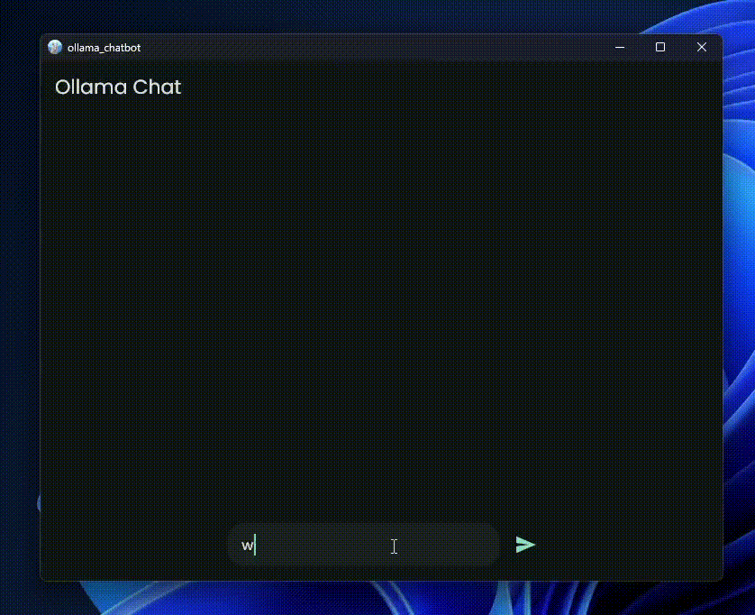

# Ollama Chat 🚀



## 🔥 Fast, Private, and Offline ChatGPT-Like Experience

Ollama Chat is a **Flutter-based** chatting application for Windows that delivers a **fast, private, and offline** AI-powered chat experience. It leverages **Ollama** and **deepseek-coder:6.7B** to create an intelligent, real-time chat interface that runs **entirely on your device**—no internet required! 🌍🔒

---

## ✨ Features

✅ **Fully Offline** – No cloud, no data tracking, complete privacy.  
✅ **Fast & Lightweight** – Runs efficiently on your local machine.  
✅ **ChatGPT-Like Interface** – Intuitive and user-friendly UI.  
✅ **Powered by Ollama & deepseek-coder:6.7B** – Optimized for speed and intelligence.  
✅ **Cross-Platform Potential** – Built with Flutter, making future expansion easy.  

---

## 🚀 Getting Started

### 1️⃣ Prerequisites
- Windows OS
- [Ollama](https://ollama.com/) installed
- deepseek-coder:6.7B model set up

### 2️⃣ Installation
```sh
# Clone the repository
git clone https://github.com/ahmed-wael2002/ollama-flutter-chatbot.git
cd ollama-chat

# Run the Flutter application
flutter run
```

---

## 📸 Demo
Check out the app in action! 👇


---

## 🛠️ Technologies Used
- **Flutter** – Beautiful, natively compiled UI
- **Dart** – Efficient and modern programming language
- **Ollama** – Local AI inference engine
- **deepseek-coder:6.7B** – Powerful AI model for chat interactions

---

## 🤝 Contributing
We welcome contributions! Feel free to open issues, submit pull requests, or suggest new features. 

---

## 📜 License
This project is completely open-source, feel free to clone or fork and be creative!

---

### 💡 Stay Connected
For updates and discussions, follow [@your-username](https://github.com/ahmed-wael2002)!

---

🚀 **Get started with Ollama Chat today and experience AI-powered conversations at lightning speed, all while keeping your data private!**
